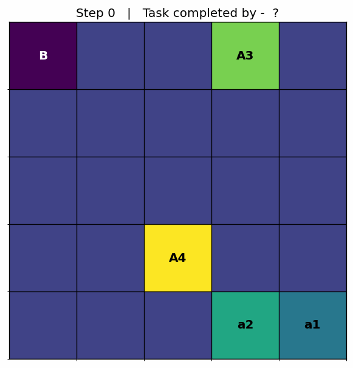

# Multi‑Agent Q‑Learning GridWorld



> *Four little agents, one juicy secret, and a rendezvous point called **B**. Can they coordinate (via Q‑learning) to share the secret and finish the task efficiently?*

---

## TL;DR (Quick Start)

```bash
# 1. Create & activate a venv, install deps
python -m venv venv
venv\Scripts\activate  # (Windows)
# or: source venv/bin/activate
pip install -r requirements.txt

# 2. Train (uses defaults or a YAML)
python train.py --cfg config/default.yaml

# 3. Evaluate exhaustively
python evaluate.py

# 4. Plot reward/loss/epsilon curves
python plots.py

# 5. Make a GIF of a run
python gif.py --clean
# or
python gif.py --manual "2,2 0,0 4,4 0,4 4,0"

# 6. Need a reminder of commands?
python instruct.py
```

---

## Repository Structure

```
├─ agent.py               # DQNAgent wrapper (epsilon-greedy, replay, target sync)
├─ dqn.py                 # Online/target networks, train_one_step, save/load
├─ environment.py         # GridWorld env: states, rewards, secret exchange logic
├─ train.py               # Training loop (warm-up, logging, save artifacts)
├─ evaluate.py            # Exhaustive config evaluation & metrics (SR, AEP, etc.)
├─ plots.py               # reward/loss/epsilon plots → assets/plots/
├─ gif.py                 # Generate GIF directly (argparse options)
├─ make_gif_frames.py     # Frame-by-frame PNGs + GIF stitching (1 fps loop)
├─ frames.py              # (Optional) frame viewer / utilities
├─ instruct.py            # One-page CLI cheat-sheet
├─ config/
│  └─ default.yaml        # Example hyper-parameter config (if you added this)
├─ runs/                  # Training artifacts (checkpoints, *.npy, run_config.json)
├─ assets/
│  ├─ demo.gif            # Your showcase animation
│  └─ plots/              # reward_curve.png, loss_curve.png, epsilon_curve.png
└─ requirements.txt       # Python deps
```

---

## The Task

* **Grid**: N×N cells (5x5 in this example).
* **Agents**: Multiple agents split into *types* (0 or 1). They start at random cells.
* **Secret**: Only by meeting an agent of the opposite type can an agent acquire the **full secret** (spreadable).
* **Goal (B)**: Any agent with the full secret reaching cell **B** ends the episode.
* **Rewards** (tunable in YAML / train.py):

  * Move penalty `move: -1`
  * Invalid move `invalid_move: -5`
  * Exchange bonus `secret_exchange: 20`
  * Reach B with secret `reach_b_with_full_secret: 100`
  * Reach B without secret `reach_b_without_secret: -5`

### State Representation (length 7)

```
[ agent_x, agent_y, B_x, B_y, has_full_secret (0/1), closest_opp_x, closest_opp_y ]
```

All positions are normalized by `(grid_size - 1)`.

### Actions (0..3)

```
0: North  1: South  2: West  3: East
```

---

## Learning Setup

* **DQN with target network** (`dqn.py`):

  * `online` (θ) & `target` (θ′) networks (2× hidden layers of size 24 by default)
  * MSE loss on TD targets, Adam optimizer
  * Hard target update every `target_update_freq` steps (handled via `agent.increment_step()`)
* **Replay buffer**: Agents of the same type share a replay buffer (simple `collections.deque`), sampled with `random.sample()`.
* **Epsilon‑greedy exploration**: Start high ε, decay each episode until `epsilon_min`, saved to `runs/epsilons.npy` for plotting.

---

## Training (`train.py`)

* **Warm‑up**: `collect_initial_experiences()` runs random steps to fill buffers.
* **Training loop**: Per episode, agents act, store transitions, sample & train.
* **Logging**: Every 100 episodes prints `{episode: rewards per agent, loss, ε, steps}`.
* **Artifacts Saved to `/runs`**:

  * `checkpoint_final.pt` – final weights (online net)
  * `episode_rewards.npy` – total reward per episode
  * `losses.npy` – mean loss per episode
  * `epsilons.npy` – ε value per episode
  * `run_config.json` – grid size, agent layout, state/action sizes
* **KeyboardInterrupt**: `Ctrl+C` → still saves everything.

Run with overrides:

```bash
python train.py --cfg config/default.yaml
# ad‑hoc override
python train.py --grid-size 6 --episodes 5000
```

---

## Plotting (`plots.py`)

Generates PNGs into `assets/plots/`:

* `reward_curve.png`
* `loss_curve.png`
* `epsilon_curve.png` (if epsilons.npy exists)

```bash
python plots.py                # defaults to runs/
python plots.py --run other_runs_dir  --out assets/plots
```

---

## Evaluation (`evaluate.py`)

Exhaustively tests **all unique configurations** (symmetry‑reduced) or brute-force combos depending on your version, and reports:

* Success rate
* Average steps per episode
* % under a certain step threshold
* AEP (Average Excess Path length)

```bash
python evaluate.py --step-threshold 15 --max-steps 100
```

You can warn users how many configurations will be tested by printing the estimate first (we added that in newer versions).

---

## GIFs & Frames

```bash
python gif.py                       # random start
python gif.py --manual "2,2 0,0 4,4 0,4 4,0"  # B, then each agent
# extras: --ckpt, --cfg, --out, --tmp, --clean
```
Override previous saved frames and save new using the following --clean method
```bash
python make_gif_frames.py --clean
```

* Prompts whether to keep PNG frames at the end.
* Non‑overlapping arrows, labels for overlapping agents handled.
* Title on every frame with `Step N | Task completed by – A?`.

Want slower/faster GIF? Change `fps` in the `imageio.get_writer()` call.

---

## instruct.py – your CLI cheat‑sheet

Running `python instruct.py` prints a single-page list of all commands & options so you never have to remember flags.                                                  |

---

## License / Credits
(MIT License)

---

